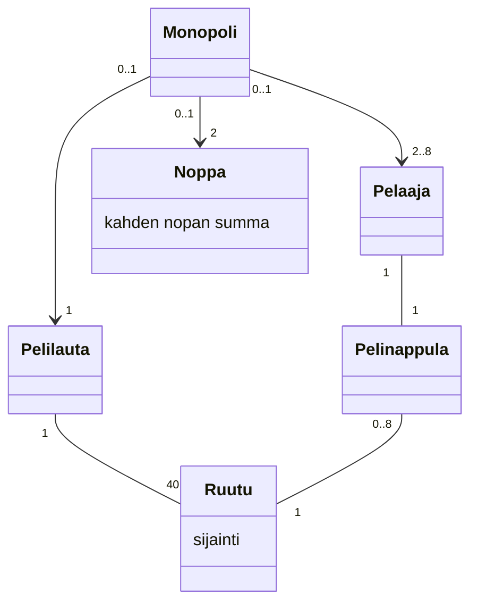

```mermaid
	classDiagram
		Monopoli "0..1" --> "1" Pelilauta
		Monopoli "0..1" --> "2..8" Pelaaja
		Pelilauta "1" -- "40" Ruutu
		Monopoli "0..1" --> "2" Noppa
		Pelaaja "1" -- "1" Pelinappula
		Pelinappula "0..8" -- "1" Ruutu
		class Monopoli{
		}
		class Noppa{
			kahden nopan summa
		}
		class Pelaaja{
		}
		class Pelilauta{
		}
		class Ruutu{
			sijainti	
		}
		class Pelinappula{
		}
```
		
		
		
		
	
	