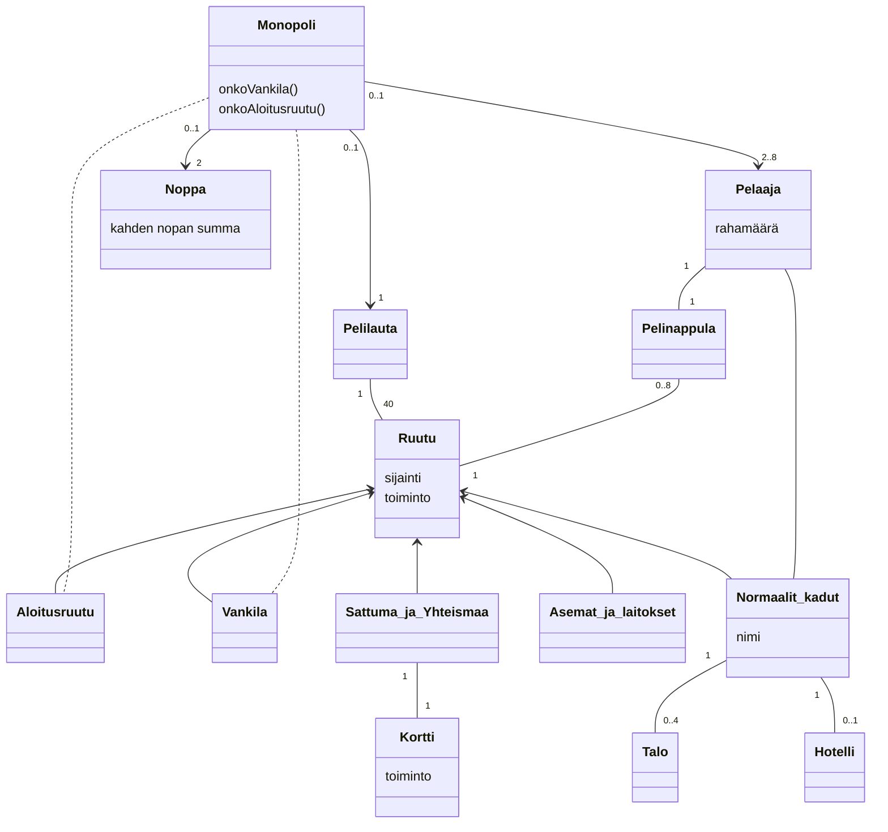

```mermaid
	classDiagram
		Monopoli "0..1" --> "1" Pelilauta
		Monopoli "0..1" --> "2..8" Pelaaja
		Pelilauta "1" -- "40" Ruutu
		Monopoli "0..1" --> "2" Noppa
		Pelaaja "1" -- "1" Pelinappula
		Pelinappula "0..8" -- "1" Ruutu
		Ruutu <-- Aloitusruutu
		Ruutu <-- Vankila
		Ruutu <-- Sattuma_ja_Yhteismaa
		Ruutu <-- Asemat_ja_laitokset
		Ruutu <-- Normaalit_kadut
		Sattuma_ja_Yhteismaa "1" -- "1" Kortti
		Pelaaja -- Normaalit_kadut
		Normaalit_kadut "1" -- "0..4" Talo
		Normaalit_kadut "1" -- "0..1" Hotelli
		Monopoli .. Vankila
		Monopoli .. Aloitusruutu
		class Monopoli{
			onkoVankila()
			onkoAloitusruutu()
		}
		class Noppa{
			kahden nopan summa
		}
		class Pelaaja{
			rahamäärä
		}
		class Pelilauta{
		}
		class Ruutu{
			sijainti
			toiminto
		}
		class Pelinappula{
		}
		class Aloitusruutu{
		}
		class Vankila{
		}
		class Sattuma_ja_Yhteismaa{
		}
		class Asemat_ja_laitokset{
		}
		class Normaalit_kadut{
			nimi
		}
		class Kortti{
			toiminto
		}
		class Talo{
		}
		class Hotelli{
		}
```