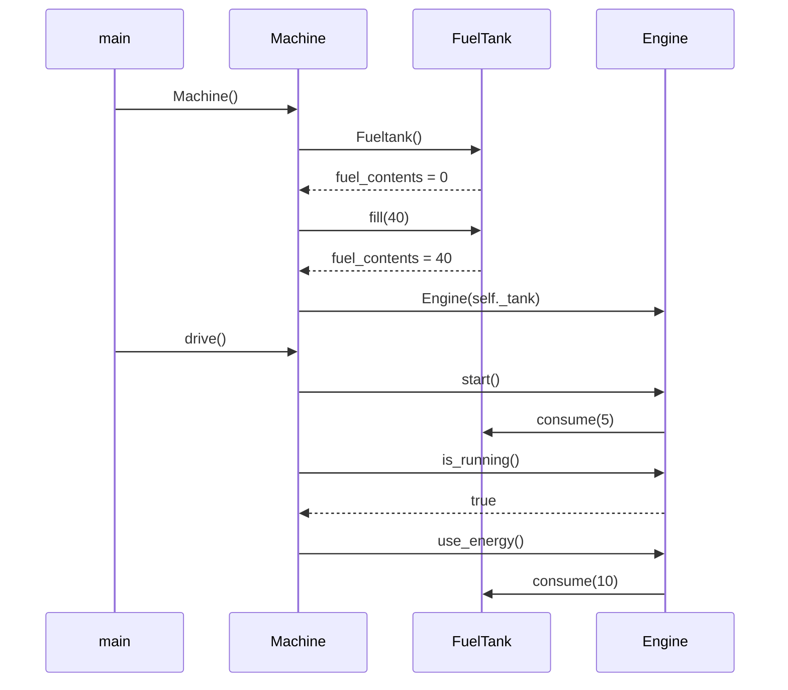

```mermaid
	sequenceDiagram
		main->>Machine: Machine()
		Machine->>FuelTank: Fueltank()
		FuelTank-->>Machine: fuel_contents = 0
		Machine->>FuelTank: fill(40)
		FuelTank-->>Machine: fuel_contents = 40
		Machine->>Engine: Engine(self._tank)
		main->>Machine: drive()
		Machine->>Engine: start()
		Engine->>FuelTank: consume(5)
		Machine->>Engine: is_running()
		Engine-->>Machine: true
		Machine->>Engine: use_energy()
		Engine->>FuelTank: consume(10)
```