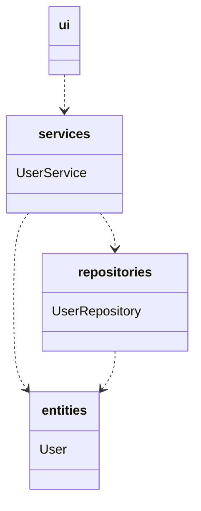
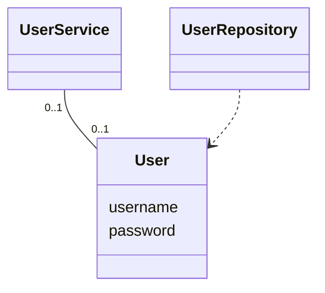
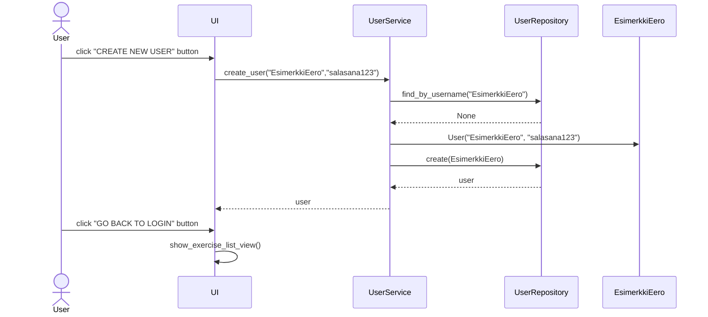
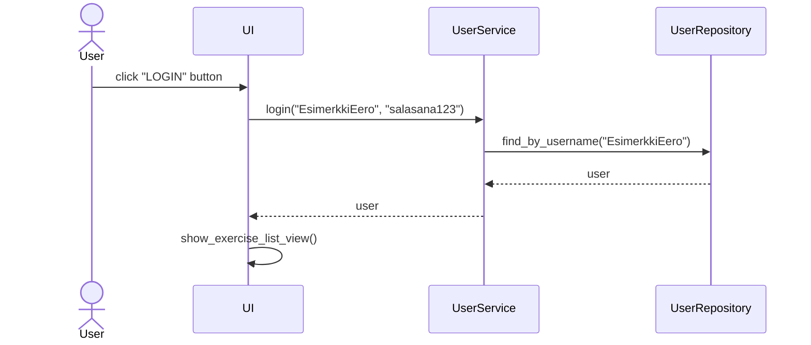
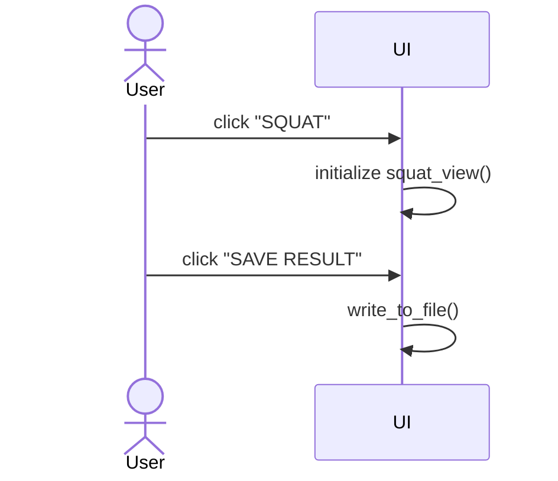
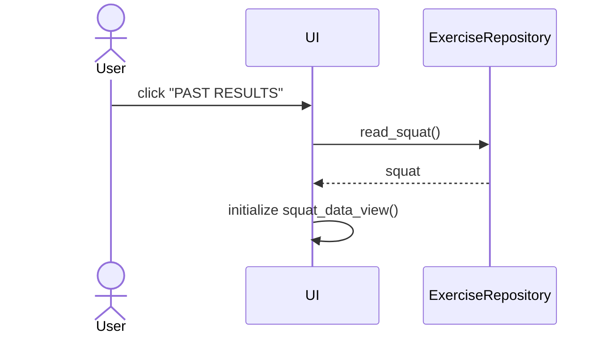
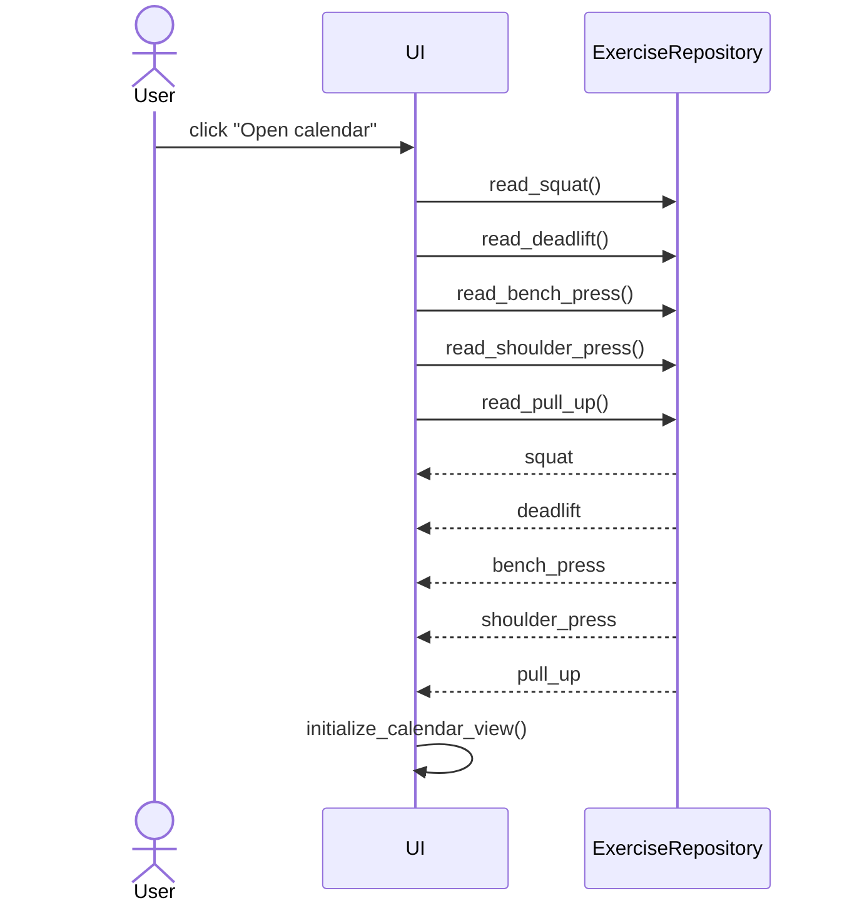

# Arkkitehtuuri

## Rakenne

Koodin pakkaus-/luokkakaavio on:

_ui_ sisältää käyttöliittymän koodin. 
_services_ sisältää sovelluslogiikan koodin.
_repositories_ sisältää tietojen tallennukseen vastaavan koodin.
_entities_ sisältää käyttäjän luokan.

## Käyttöliittymä

Käyttöliittymä sisältää seuraavat näkymät:

- Kirjautuminen
- Uuden käyttäjän luominen
- Harjoitus-lista
- Valitun harjoituksen sivu (jokaiselle oma sivu), jossa voi kirjata uuden tuloksen
	- Squat (Kyykky)
	- Deadlift (Maastaveto)
	- Bench Press (Penkkipunnerrus)
	- Shoulder Press (Pystypunnerrus)
	- Pull Up (Leuanveto)
- Valitun harjoituksen tuloslista (jokaiselle oma sivu)
	- Squat (Kyykky)
	- Deadlift (Maastaveto)
	- Bench Press (Penkkipunnerrus)
	- Shoulder Press (Pystypunnerrus)
	- Pull Up (Leuanveto)
- Kalenteri
	- Kalenterista näkee päivät (merkitty vihreällä värillä) jolloin käyttäjä on harjoitellut
	
UI-luokka vastaa näkymien näyttämisestä. Käyttöliittymä on lähes kokonaan eristetty sovelluslogiikasta, uuden harjoitus-tuloksen kirjoitus on jäänyt osaksi UI-luokan koodia.
Käyttöliittymän jokainen näkymä on toteutettu omana luokkana.

## Sovelluslogiikka
 
Luokka User kuvaa käyttäjiä.


UserService luokan User-olio vastaa kaikesta käyttäjän toiminnasta. Luokka tarjoaa seuraavat metodit:
- create_user(username,password)
- login(username,password)
- get_user()
- get_users()
- logout()

UserService pääsee käyttäjän tietoihin UserRepository-luokan kautta. 

## Tietojen pysyväistallennus

Pakkauksen repositories `UserRepository` luokka vastaa käyttäjän tietojen tallennuksesta SQLite-tietokantaan. Pakkauksen repositories `ExerciseRepository` luokka vastaa käyttäjän tulosten lukemisesta csv-tiedostosta.

### Tiedostot

Käyttäjien tiedot tallennetaan Data hakemistossa sijaitsevaan [SQL-tietokantatiedostoon](/python-strength-app/data/database.sqlite) . 
Käyttäjät tallennetaan SQLite-tietokannan tauluun `users`. Taulu alustetaan [initialize_database.py](https://github.com/nikihietala/ot-harjoitustyo/blob/master/python-strength-app/src/initialize_database.py) -tiedostossa.

Sovellus tallentaa voimailuliikkeiden kirjatut tulokset CSV-tiedostoon formaatissa:

```
29.4.2022,5 reps,30 kg,matti
30.4.2022,5 reps,100 kg,esimerkkieero
```

Päivämäärä, toistomäärä, paino, käyttäjätunnus. Kenttien arvot erotellaan pilkulla (,).
CSV-tiedoston ensimmäinen rivi on `Date,Best Rep,Weight,Name`, ja tulokset tallennetaan riviltä 2 lähtien.


## Toiminnallisuudet

### Uuden käyttäjän luominen

Käyttääkseen sovellusta on luotava käyttäjätunnus. Sovellus avautuu kirjautumisnäkymään, jossa voidaan painaa "Create new user" painiketta päästäkseen uuden käyttäjän luomisnäkymään.
Seuraava sekvenssikaavio näyttää käyttäjänluonnin toiminnallisuuden:


### Käyttäjän kirjaantuminen

Kun sovelluksen käyttäjä on luonut käyttäjätunnuksen, hän voi kirjautua sisään kirjoittamalla käyttäjätunnuksen ja salasanan kirjautumisnäkymään, jonka jälkeen painetaan "LOGIN" painiketta.
Seuraava sekvenssikaavio näyttää kirjautumisen toiminnallisuuden:


### Uuden tuloksen kirjaaminen

Kun käyttäjä on kirjannut itsensä sovellukseen, käyttäjä voi valita harjoituksen (esim. Squat) painamalla "Squat"-painiketta. Tämä avaa kyseisen harjoituksen näkymän, jossa voi tallentaa
uuden tuloksen. Seuraava sekvenssikaavio näyttää kuinka uuden tuloksen kirjaaminen toimii:

Käyttäjä täyttää uuden harjoituksen tiedot annettuun kenttään. Tämän jälkeen hän painaa "Save result"-painiketta, jonka jälkeen ohjelma kirjoittaa tiedot talteet.

### Uuden tuloksen tarkastaminen

Kun käyttäjä on valitsemansa harjoituksen (esim. Squat) kirjaamisvalikossa, voi käyttäjä painaa "PAST RESULTS"-painiketta. Tämä avaa kyseisen harjoituksen tulosnäkymän, jossa voi tarkastella kaikkia edellisiä kirjattuja tuloksia.
Seuraava sekvenssikaavio näyttää kuinka tulosten tarkastaminen toimii.

Käyttöliittymä hakee kirjautuneen käyttäjän kirjaamat tulokset ExerciseRepositoryn kyseisen harjoituksen metodia (Esim. read_squat()) kutsumalla. Käyttöliittymä näyttää harjoitukset sen initialize() metodilla.

### Kalenterinäkymän katselu

Kun käyttäjä on kirjannut itsensä sovellukseen, käyttäjä voi painaa "Open calendar"-painiketta. Tämä avaa kalenterinäkymän, jossa käyttäjä näkee kalenterin, jossa on merkitty käyttäjän aikaisemmat harjoittelupäivät.
Seuraava sekvenssikaavio näyttää kuinka kalenteri toimii.

Käyttöliittymä hakee kirjautuneen käyttäjän kaikki kirjaamat tulokset ExerciseRepositoryn metodeita kutsumalla. Sen jälkeen käyttöliittymä näyttää kalenterinäkymän initialize() metodilla.

### Ohjelman rakenteeseen jääneet heikkoudet

Graafisen käyttöliittymän koodissa (UI-luokka) on paljon toisteisuutta, ja yksi sinne kuulumaton metodi (csv-tiedostoon kirjoittaminen tapahtuu suoraan käyttöliittymän luokassa). Myös eri harjoituksen sivujen koodit sisältää paljon toisteisuutta.
