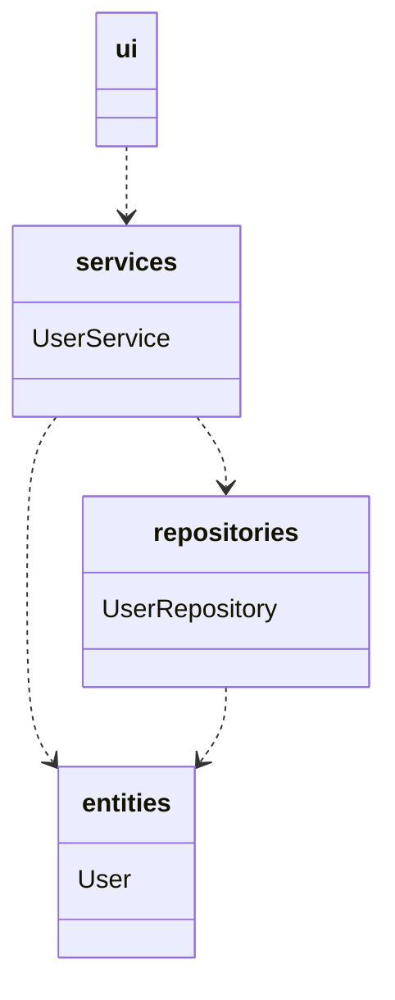
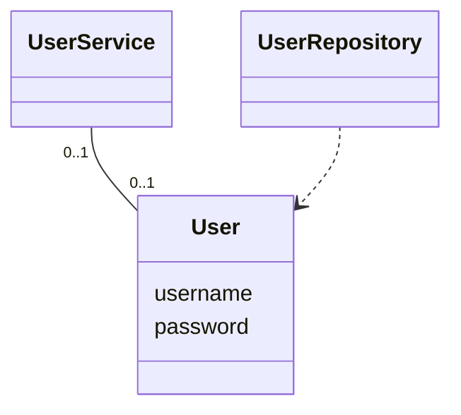
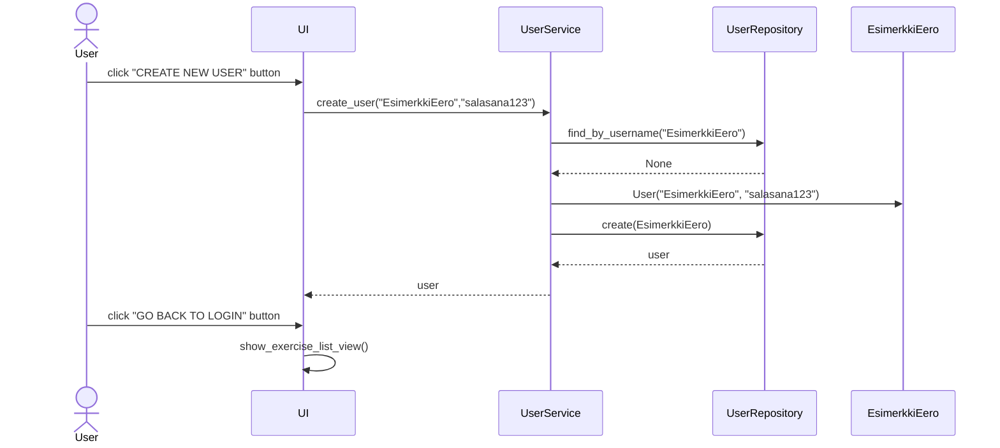
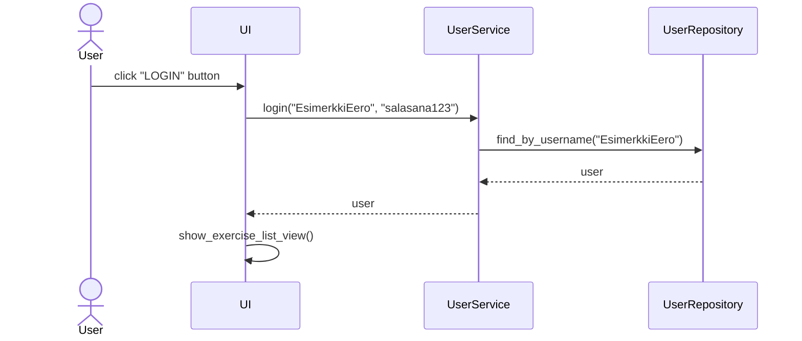
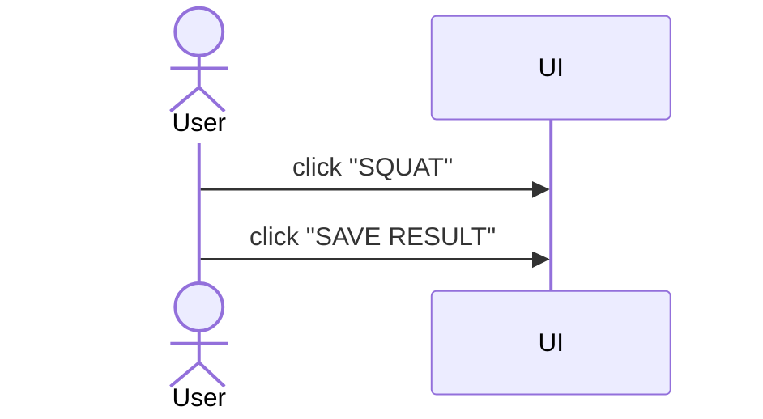

# Arkkitehtuuri

## Rakenne

Koodin pakkaus-/luokkakaavio on:

_ui_ sisältää käyttöliittymän koodin. 
_services_ sisältää sovelluslogiikan koodin.
_repositories_ sisältää tietojen tallennukseen vastaavan koodin.
_entities_ sisältää käyttäjän luokan.

## Käyttöliittymä

Käyttöliittymä sisältää seuraavat näkymät:

- Kirjautuminen
- Uuden käyttäjän luominen
- Harjoitus-lista
- Valitun harjoituksen sivu (jokaiselle oma sivu)
	- Squat (Kyykky)
	- Deadlift (Maastaveto)
	- Bench Press (Penkkipunnerrus)
	- Shoulder Press (Pystypunnerrus)
	- Pull Up (Leuanveto)
- Valitun harjoituksen tuloslista (jokaiselle oma sivu)
	- Squat (Kyykky)
	- Deadlift (Maastaveto)
	- Bench Press (Penkkipunnerrus)
	- Shoulder Press (Pystypunnerrus)
	- Pull Up (Leuanveto)
- Kalenteri

## Sovelluslogiikka
 
 Luokka User kuvaa käyttäjiä.


## Tietojen pysyväistallennus

Pakkauksen repositories `UserRepository` luokka vastaa käyttäjän tietojen tallennuksesta SQLite-tietokantaan.

### Tiedostot

Käyttäjien tiedot tallennetaan Data hakemistossa sijaitsevaan [SQL-tietokantatiedostoon](/python-strength-app/data/database.sqlite) . 
Käyttäjät tallennetaan SQLite-tietokannan tauluun `users`. Taulu alustetaan [initialize_database.py](https://github.com/nikihietala/ot-harjoitustyo/blob/master/python-strength-app/src/initialize_database.py) -tiedostossa.

Sovellus tallentaa voimailuliikkeiden kirjatut tulokset CSV-tiedostoon formaatissa:

```
29.4.2022,5 reps,30 kg,matti
30.4.2022,5 reps,100 kg,esimerkkieero
```

Päivämäärä, toistomäärä, paino, käyttäjätunnus. Kenttien arvot erotellaan pilkulla (,).
CSV-tiedoston ensimmäinen rivi on `Date,Best Rep,Weight,Name`, ja tulokset tallennetaan riviltä 2 lähtien.


## Toiminnallisuudet

### Uuden käyttäjän luominen

Käyttääkseen sovellusta on luotava käyttäjätunnus. Sovellus avautuu kirjautumisnäkymään, jossa voidaan painaa "Create new user" painiketta päästäkseen uuden käyttäjän luomisnäkymään.
Seuraava sekvenssikaavio näyttää käyttäjänluonnin toiminnallisuuden:


### Käyttäjän kirjaantuminen

Kun sovelluksen käyttäjä on luonut käyttäjätunnuksen, hän voi kirjautua sisään kirjoittamalla käyttäjätunnuksen ja salasanan kirjautumisnäkymään, jonka jälkeen painetaan "LOGIN" painiketta.
Seuraava sekvenssikaavio näyttää kirjautumisen toiminnallisuuden:


### Uuden tuloksen kirjaaminen

Kun käyttäjä on kirjannut itsensä sovellukseen, käyttäjä voi valita harjoituksen (esim. Squat) painamalla "Squat"-painiketta. Tämä avaa kyseisen harjoituksen näkymän, jossa voi tallentaa
uuden tuloksen. Seuraava sekvenssikaavio näyttää kuinka uuden tuloksen kirjaaminen toimii:


	
			
			
			