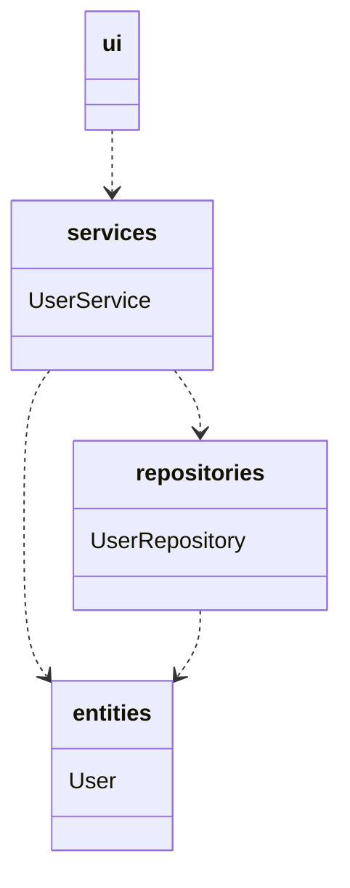
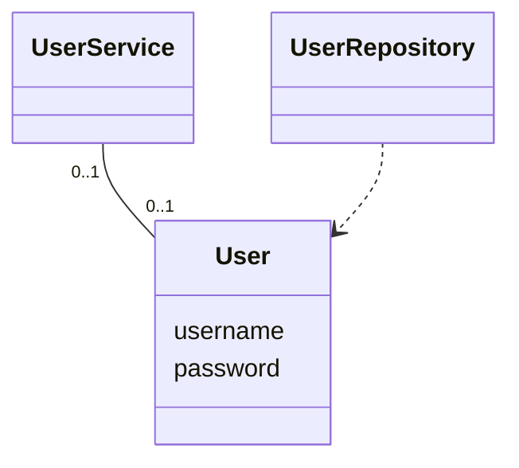
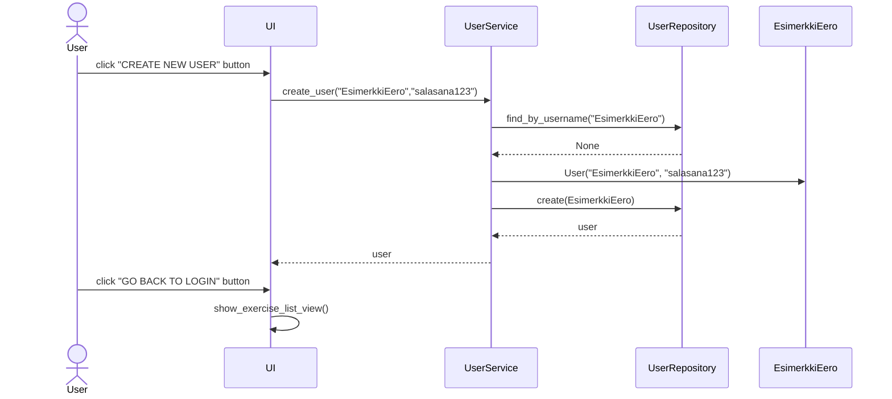
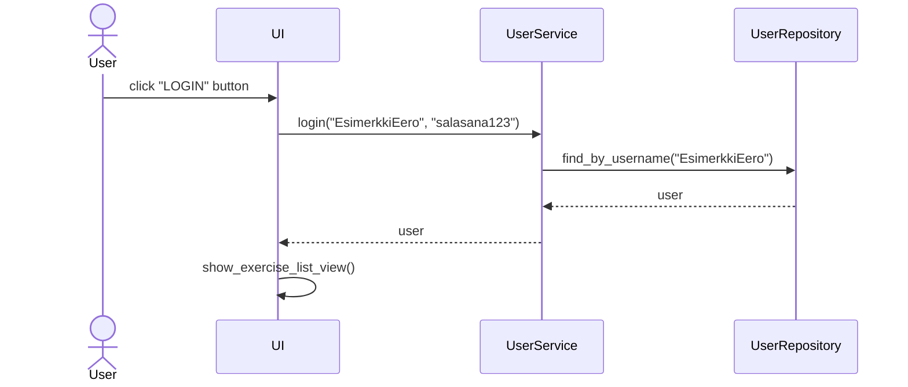
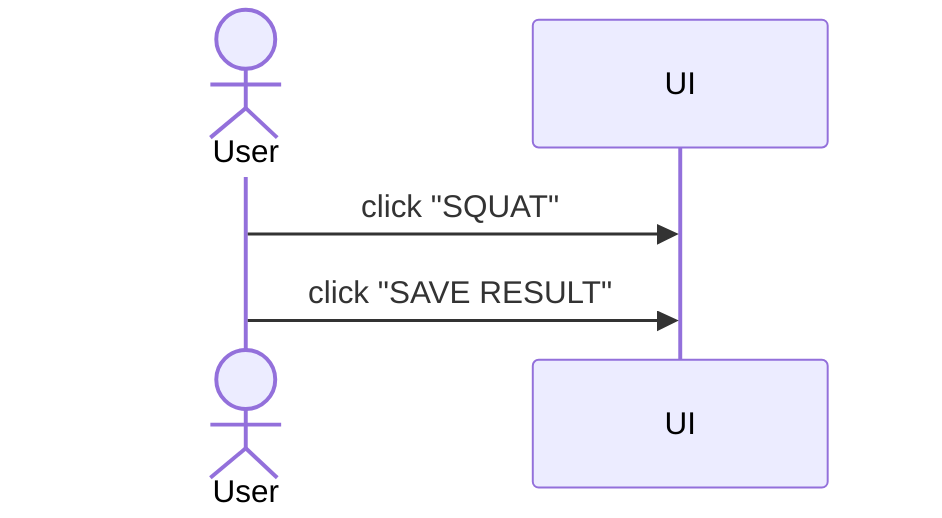

# Arkkitehtuuri

## Rakenne

Koodin pakkaus-/luokkakaavio on:

 ## Sovelluslogiikka
 
 Luokka User

## Toiminnallisuudet

### Uuden käyttäjän luominen

Käyttääkseen sovellusta on luotava käyttäjätunnus. Sovellus avautuu kirjautumisnäkymään, jossa voidaan painaa "Create new user" painiketta päästäkseen uuden käyttäjän luomisnäkymään.
Seuraava sekvenssikaavio näyttää käyttäjänluonnin toiminnallisuuden:

### Käyttäjän kirjaantuminen

Kun sovelluksen käyttäjä on luonut käyttäjätunnuksen, hän voi kirjautua sisään kirjoittamalla käyttäjätunnuksen ja salasanan kirjautumisnäkymään, jonka jälkeen painetaan "LOGIN" painiketta.
Seuraava sekvenssikaavio näyttää kirjautumisen toiminnallisuuden:

### Uuden tuloksen kirjaaminen

Kun käyttäjä on kirjannut itsensä sovellukseen, käyttäjä voi valita harjoituksen (esim. Squat) painamalla "Squat"-painiketta. Tämä avaa kyseisen harjoituksen näkymän, jossa voi tallentaa
uuden tuloksen. Seuraava sekvenssikaavio näyttää kuinka uuden tuloksen kirjaaminen toimii:

--kesken		
			
			
			