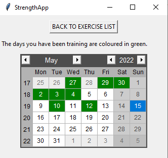

# Käyttöohje

Lataa projektin uusin lähdekoodi "Loppurelease" [täältä](https://github.com/nikihietala/ot-harjoitustyo/releases) .

## Ohjelman käynnistäminen

Ennen ohjelman käynnistämistä, avaa terminaalissa python-strength-app tiedosto ja asenna riippuvuudet komennolla:

```bash
poetry install
```

Sen jälkeen suorita alustustoimenpiteet komennolla:

```bash
poetry run invoke build
```

Sitten ohjelman voi käynnistää komennolla:

```
poetry run invoke start
```

## Kirjautuminen

Sovellus käynnistyy kirjautumisnäkymään:


Kirjautuminen onnistuu syöttämällä käyttäjätunnus & salasana, ja painamalla "LOGIN" painiketta.

## Uuden käyttäjän luominen

Jos ei ole käyttäjätunnusta, uuden voin luoda painamalla kirjautumisnäkymän "CREATE NEW USER" painiketta, joka siirtää uuden käyttäjän luomisnäkymään.

Uusi käyttäjä luodaan syöttämällä haluttu käyttäjätunnus & salasana, ja painamalla "CREATE NEW USER" painiketta. Sovellus ilmoittaa jos käyttäjätunnuksen luonti onnistuu.
Sen jälkeen takaisin kirjautumisnäkymään pääsee painamalla "GO BACK TO LOGIN" painiketta.

Sovellus ilmoittaa jos käyttäjätunnuksen luonti ei onnistu, jolloin täytyy tehdä muutoksia:
	- Käyttäjätunnus ei saa olla jo olemassa
	- Käyttäjätunnus oltava vähintään 4 merkkiä
	- Salasana oltava vähintään 6 merkkiä


## Urheiluharjoituksen valitseminen

Onnistuneen kirjautumisen jälkeen siirrytään urheilulista-näkymään:


Käyttäjä voi valita halutun harjoituksen painalla valitsemansa harjoituksen painiketta (Esim. Squat), tai siirtyä kalenterinäkymään painamalla "Open calendar". 
"BACK TO LOGIN"-painike kirjaa käyttäjän ulos sovelluksesta, ja sovellus palaa takaisin kirjautumisnäkymään.

## Uuden harjoituksen kirjaaminen

Käyttäjä voi kirjata uuden harjoitus-tuloksen täyttämällä kentät (Date / Best rep / Weight). Date (päivämäärä) annetaan muodossa päivä.kuukausi.vuosi (eli esim. 15.5.2022). Best rep (parhaan sarjan toistomäärä) annetaan numerona. Weight (paino) annetaan myös numerona. 
Tiedot tallennetaan painamalla "SAVE RESULT"-painiketta, jolloin sovellus ilmoittaa jos kentät eivät ole täytetty ohjeiden mukaisesti. Sovellus myös ilmoittaa jos tallennus onnistui. "PAST RESULTS" painike vie kyseisen harjoituksen tulosten tarkastelunäkymään. 
"BACK TO EXERCISE LIST"-painike vie takaisin urheilulista-näkymään.


## Aikaisempien harjoitusten tarkastelu

Käyttäjä näkee listassa kaikki aiemmat kyseisen harjoituksen listatut tulokset. Alhaalla myös lukee suurin paino, jolla on tehty kyseisen harjoitus. "BACK TO EXERCISE LIST"-painike vie takaisin urheilulista-näkymään.


## Kalenterinäkymä

Käyttäjä näkee kalenterin, johon on merkitty vihreällä värillä päivät, jolloin käyttäjä on treenannut (eli ne päivät jolloin on listattu harjoitustulos ylös). Kalenterista klikattu päivä näkyy sinisellä värillä. 
"BACK TO EXERCISE LIST"-painike vie takaisin urheilulista-näkymään.




