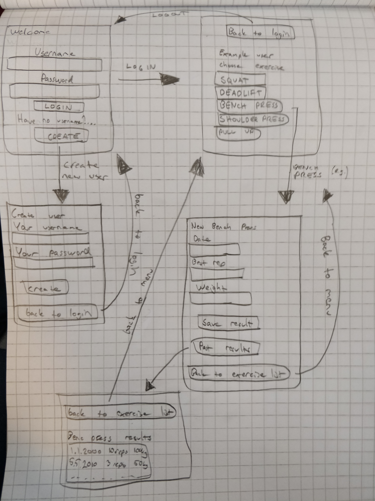

# Vaatimusmäärittely

## Sovelluksen tarkoitus

Sovelluksen avulla käyttäjä voi tallentaa tekemänsä urheilusuoritukset ylös ja seurata suorituksiaan. Jokaisella sovelluksen käyttäjällä on oma suorituslistansa.
Sovellus tarkoitettu voimailulajien suoritusten seurantaan.

## Käyttäjät

Sovelluksella on vain yksi käyttäjärooli: _normaali käyttäjä_.

## Käyttöliittymäluonnos

Sovellus koostuu neljästä näkymästä: 

Sovellus aukeaa kirjautumisvalikkoon, josta voi siirtyä joko uuden käyttäjän luomisvalikkoon tai kirjautumisen jälkeen näkyvään aloitusvalikkoon jossa on listattu 5 voimailuliikettä.
Aloitusvalikosta voi siirtyä valitsemansa liikeeseen, jossa voi tallentaa uuden suorituksen tai siirtyä tulosvalikkoon katsomaan aikaisempia kirjattuja suorituksia. Voimailuliikkeen valikosta sekä tuloslistasta pääsee takaisin aloitusvalikkoon.

## Perusversion tarjoama toiminnallisuus

### Ennen kirjautumista

- Käyttäjä voi luoda käyttäjätunnuksen ja salasana [TEHTY]
	- Käyttäjätunnus tulee olla uniikki, sekä vähintään 4 merkkiä pitkä [TEHTY]
	- Salasana tulee olla vähintään 6 merkkiä pitkä [TEHTY]
- Käyttäjä voi kirjautua järjestelmään [TEHTY]
	- Kirjautuminen onnistuu jos käyttäjätunnus sekä salasana ovat oikeat [TEHTY]
	- Jos käyttäjätunnus ei ole olemassa, tai salasana on väärä, kirjautuminen ei onnistu [TEHTY]

### Kirjautumisen jälkeen

- Käyttäjä näkee aloitusvalikossa 5 urheilusuoritus-vaihtoehtoa (BENCH PRESS / SQUAT / DEADLIFT / SHOULDER PRESS / PULL UPS) eli voimailulajien pääliikkeet [TEHTY]
	- Käyttäjä voi kirjoittaa tuloksen ylös, joka tallentaa sen csv tiedostoon [TEHTY]
		- (päivämäärä, paras toistomäärä, paino) [TEHTY]
	- Käyttäjä voi avata tuloslistan, josta näkee aiemmat kirjatut tulokset [TEHTY]
		- Suorituslistassa näkyy päivämäärä sekä tulos(paras toistomäärä ja millä painolla) [TEHTY]
- Jokaisella käyttäjällä on henkilökohtaiset suoritukset, jotka vain kyseinen käyttäjä itse näkee [TEHTY]
- Käyttäjä voi palata suorituslistasta takaisin aloitusvalikkoon [TEHTY]
- Käyttäjä voi kirjauta ulos järjestelmästä aloitusvalikosta [TEHTY]

## Jatkokehitysideoita

- Käyttäjällä olisi kaverilista, johon voi lisätä toisen käyttäjän kaveriksi
	- Kaverit näkisivät toistensa suoritukset
- Käyttäjätunnuksen voisi poistaa
- Suorituksia voisi tarkastella
	- Esim. ilmoittaisi kyseisen liikkeen parhaan suorituksen
	- Esim. luoda kehityskäyrä kaikista listan suorituksesta joka visualisoi suoritukset
	- Esim. nähdä yhteenveto kuinka usein on tehnyt suorituksia
- Urheilusuorituksia voisi suodattaa, että esim. käyttäjä voi valita omat vaihtoehdot joita seurata ja nähdä valikossa vain vaitsemansa vaihtoehdot.
- Sovellus tarjoaisi myös urheilukalenterin, johon voi merkitä milloin on treenannut.
	- Voisi merkitä myös muun urheilun kun vain kuntosalitreenin

	

