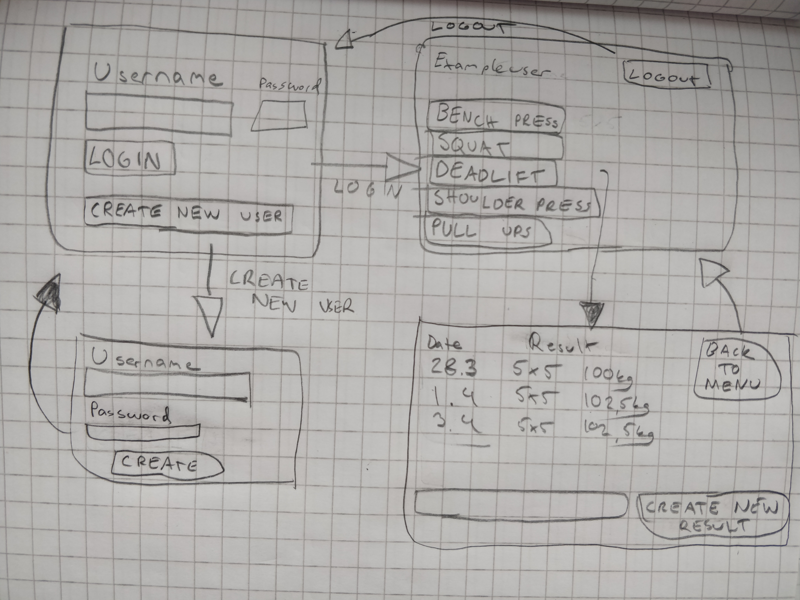

# Vaatimusmäärittely

## Sovelluksen tarkoitus

Sovelluksen avulla käyttäjä voi tallentaa tekemänsä urheilusuoritukset ylös ja seurata suorituksiaan. Jokaisella sovelluksen käyttäjällä on oma suorituslistansa.
Sovellus tarkoitettu voimailulajien suoritusten seurantaan.

## Käyttäjät

Sovelluksella on vain yksi käyttäjärooli: _normaali käyttäjä_.

## Käyttöliittymäluonnos

Sovellus koostuu neljästä näkymästä: 

Sovellus aukeaa kirjautumisvalikkoon, josta voi siirtyä joko uuden käyttäjän luomisvalikkoon tai kirjautumisen jälkeen näkyvään aloitusvalikkoon.
Aloitusvalikosta voi siirtyä valitsemansa urheilusuorituksen suorituslistaan, jossa on listattu kaikki kyseisen urheilusuorituksen suoritukset, ja voi tallentaa uuden suorituksen. Suorituslistasta pääsee takaisin aloitusvalikkoon.

## Perusversion tarjoama toiminnallisuus

### Ennen kirjautumista

- Käyttäjä voi luoda käyttäjätunnuksen ja salasanan
	- Käyttäjätunnus tulee olla uniikki, sekä vähintään 4 merkkiä pitkä
	- Salasana tulee olla vähintään 6 merkkiä pitkä
- Käyttäjä voi kirjautua järjestelmään
	- Kirjautuminen onnistuu jos käyttäjätunnus sekä salasana ovat oikeat
	- Jos käyttäjätunnus ei ole olemassa, tai salasana on väärä, kirjautuminen ei onnistu

### Kirjautumisen jälkeen

- Käyttäjä näkee aloitusvalikossa 5 urheilusuoritus-vaihtoehtoa (BENCH PRESS / SQUAT / DEADLIFT / SHOULDER PRESS / PULL UPS) eli voimailulajien pääliikkeet
	- Käyttäjä voi kirjoittaa tuloksen ylös, joka tallentaa sen csv tiedostoon
		- (päivämäärä, paras toistomäärä, paino)
	- Käyttäjä voi avata tuloslistan, josta näkee aiemmat kirjatut tulokset
		- Suorituslistassa näkyy päivämäärä sekä tulos(paras toistomäärä ja millä painolla)
- Jokaisella käyttäjällä on henkilökohtaiset suoritukset, jotka vain kyseinen käyttäjä itse näkee
- Käyttäjä voi palata suorituslistasta takaisin aloitusvalikkoon
- Käyttäjä voi kirjauta ulos järjestelmästä aloitusvalikosta

## Jatkokehitysideoita

- Käyttäjällä olisi kaverilista, johon voi lisätä toisen käyttäjän kaveriksi
	- Kaverit näkisivät toistensa suoritukset
- Käyttäjätunnuksen voisi poistaa
- Suorituksia voisi tarkastella
	- Esim. ilmoittaisi kyseisen liikkeen parhaan suorituksen
	- Esim. luoda kehityskäyrä kaikista listan suorituksesta joka visualisoi suoritukset
	- Esim. nähdä yhteenveto kuinka usein on tehnyt suorituksia
- Urheilusuorituksia voisi suodattaa, että esim. käyttäjä voi valita omat vaihtoehdot joita seurata ja nähdä valikossa vain vaitsemansa vaihtoehdot.
- Sovellus tarjoaisi myös urheilukalenterin, johon voi merkitä milloin on treenannut.
	- Voisi merkitä myös muun urheilun kun vain kuntosalitreenin

	

